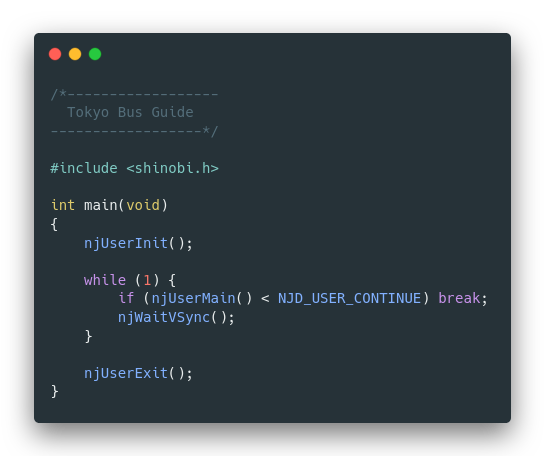

# Tokyo Bus Guide Decompilation

My attempt to decompile the Sega Dreamcast game called "Tokyo Bus Guide".



## Updates
See [this thread](https://twitter.com/lhs_azevedo/status/1508270685784793089).

## Requirements
- OS: I'm running Linux Mint. It should work on most Ubuntu-based distros. Other distros may require additional steps.
- [Wine](https://www.winehq.org/)
- Dreamcast SDK (Sega Library) Ver.1.55J (Google is your friend)

## Project Setup
1. Make sure your SDK is organized as bellow.
   ```
   ├── bin (From disc Vol.1 dc_sdk/bin)
   │   ├── binadj.exe
   │   └── ...
   ├── shc (From disc Vol.2)
   │   ├── bin
   │   ├── include
   │   └── lib
   └── shinobi (From disc Vol.2)
      ├── driver
      ├── include
      ├── lib
      └── sample
   ```

2. The Hitachi compiler suite expects some environments variables to be set. Create a copy of `set_kt.example.sh` called `set_kt.sh` and update the DK_SDK variable with your location of the SDK.

3. Source your `set_kt.sh` script to make the env vars available in the current shell:
   ```
   $ source set_kt.sh
   ```

4. You should now be able to build the binary using the `compile.sh` script (yes, no fancy makefile for now).
   ```
   ./compile.sh
   SH SERIES ASSEMBLER Ver. 4.0('98.07.06)
   Copyright (C) Hitachi, Ltd. 1992,1997
   Copyright (C) HITACHI MICROCOMPUTER SYSTEM LTD. 1992,1997
   Licensed Material of Hitachi, Ltd.
   *****TOTAL ERRORS       0
   *****TOTAL WARNINGS     0
   (...)
   ======================
   Yay! Build matches :)
   ======================
   ```

## Details

### Program sections:

| Section       | Address    |
| ------------- | ---------: |
| DSGLH         | 0x8C010000 |
| DSGLE         | 0x8C010060 |
| P             | 0x8C010080 |
| C             | 0X8C03327C |
| C32           | ?          |
| D             | ?          |
| D32           | ?          |
| PSG           | ?          |
| R             | ?          |
| R32           | ?          |
| CSG           | ?          |
| CSG32         | ?          |
| DSG           | ?          |
| DSG32         | ?          |

## Useful resources
- [Dreamcast Programming](https://mc.pp.se/dc/) by Marcus Comstedt
- [Flycast source code](https://github.com/flyinghead/flycast)
- [My trashy Flycast debugger](https://github.com/lhsazevedo/flycast/tree/dbgnet)
- Dreamcast SDKs
